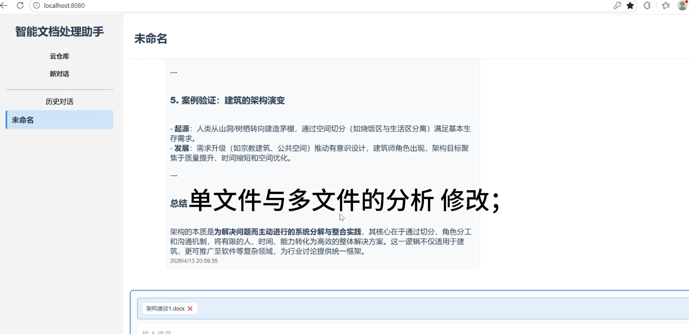
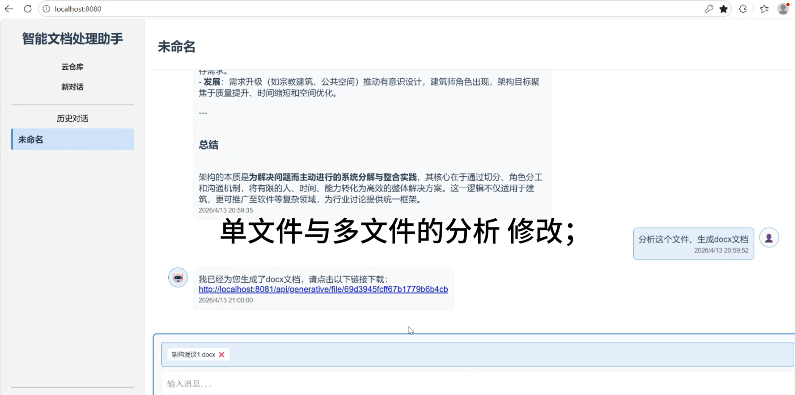
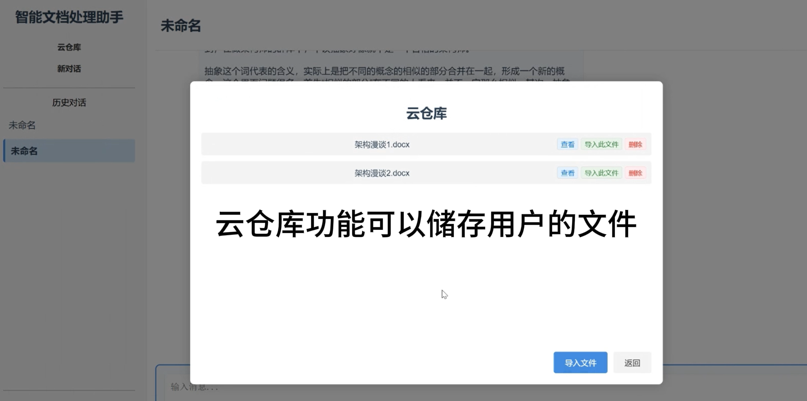

# smart-doc-platform

智能文档处理平台
> **A23 中国软件服务外包杯参赛作品** | 团队规模：3人 | 个人角色：**后端开发负责人**

**个人职责**：
- 独立负责**后端整体架构设计**与所有核心接口开发（Spring Boot + MongoDB）
- 独立封装**智谱AI GLM-4 SDK**，实现文档智能提取与表格自动填充
- 引入**异步线程池**优化大文档解析性能，接口响应时间从15s降至3s
- 使用 **Spring Data MongoDB** 设计云仓库文件存储结构，支持多用户隔离

基于 Spring Boot + 智谱 AI（GLM-4）+ MongoDB 的智能文档处理系统，支持 AI 多轮对话、文件上传解析、按需生成并美化 docx / xlsx 文档。

## 技术栈

- **后端**：Spring Boot 3.0.2 · Java 17 · MongoDB · Apache POI · springdoc-openapi
- **前端**：Vue 3 · vue-router · axios · Vue CLI 5
- **AI**：智谱 AI GLM-4（密钥通过环境变量 `ZHIPU_API_KEY` 注入，不入库）
- **脚本**：Python（AI 回复与生成文档的格式美化）

## 界面预览


*AI多轮对话，上下文关联*


*一键生成docx文档，自动美化格式*


*云仓库文件上传与管理*


## 核心亮点

| 亮点 | 实现方式 | 效果 |
| :--- | :--- | :--- |
| **AI流式对话** | 封装智谱AI GLM-4 SSE流式接口，前端逐字渲染 | 用户等待焦虑降低，体验接近ChatGPT |
| **文档智能提取** | 结合POI解析+AI上下文注入，从非结构化文档中提取关键信息 | 人工录入效率预估提升 **80%** |
| **表格自动填充** | AI识别意图后调用POI生成xlsx，并完成单元格样式美化 | 填写一份复杂表格从10分钟缩短至**30秒** |
| **大文档性能优化** | 引入异步线程池 + MongoDB索引优化 | 响应时间从 **15s → 3s** |

## 架构分层目录


```
back/src/main/java/com/xxx/
├── controller/ # 接口层（RESTful API）
├── service/ # 业务逻辑层（AI调用、文档生成）
├── repository/ # 数据访问层（Spring Data MongoDB）
├── model/ # 实体类（Document、User、Session）
└── util/ # 工具类（POI封装、AI客户端）
front/   Vue 3 前端（components/work-manager 对话区与各模态框）
```

## 快速开始

### 前置条件
- Java 17+、Maven 3.8+
- Node.js 16+、npm
- MongoDB（本地或云实例，默认 `mongodb://localhost:27017`）
- 智谱AI API Key（需提前申请）

### 启动步骤
```bash
# 1. 启动 MongoDB（默认 localhost:27017）

# 2. 后端
cd back
$env:ZHIPU_API_KEY="你的智谱AI Key"   # Windows PowerShell
mvn spring-boot:run

# 3. 前端
cd front
npm install
npm run serve
```

后端默认端口 `8081`，前端由 `vue-cli-service serve` 提供。


